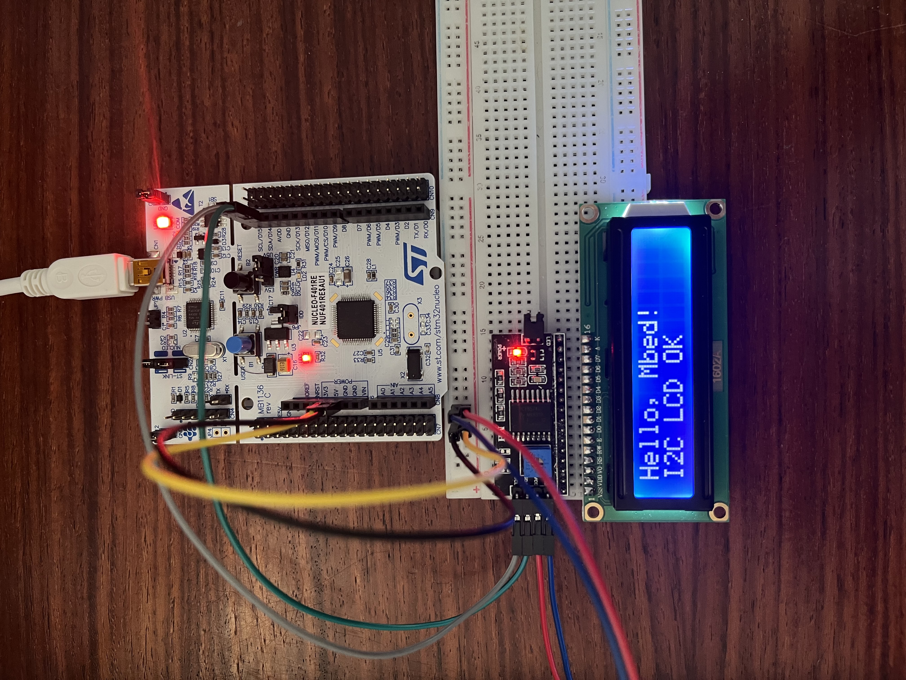
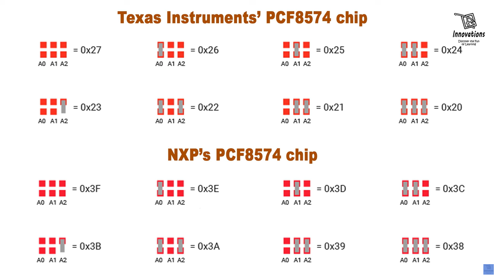

# Connecting an LCD through I2C

The following project aims to connect a LCD to the development board using serial data (SDA) and serial clock (SCL) lines to avoid excesive GPIO usage.

## 📌 Finished prototype

## 🧩 Youtube tutorial & Libraries

Watch the tutorial:
https://www.youtube.com/watch?v=SHORUnKgpKE

Download the LCD libraries for I2C communincation:
https://github.com/sstaub/mbedLCDi2c

## 📌 8-Bit Expander Adresses (by Manufacturer)

This is a list of all possible address combination one could get bridging the different combinations in the I2C expander.

