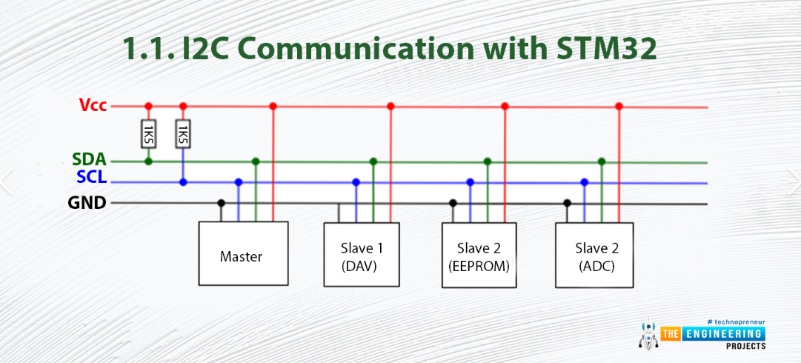
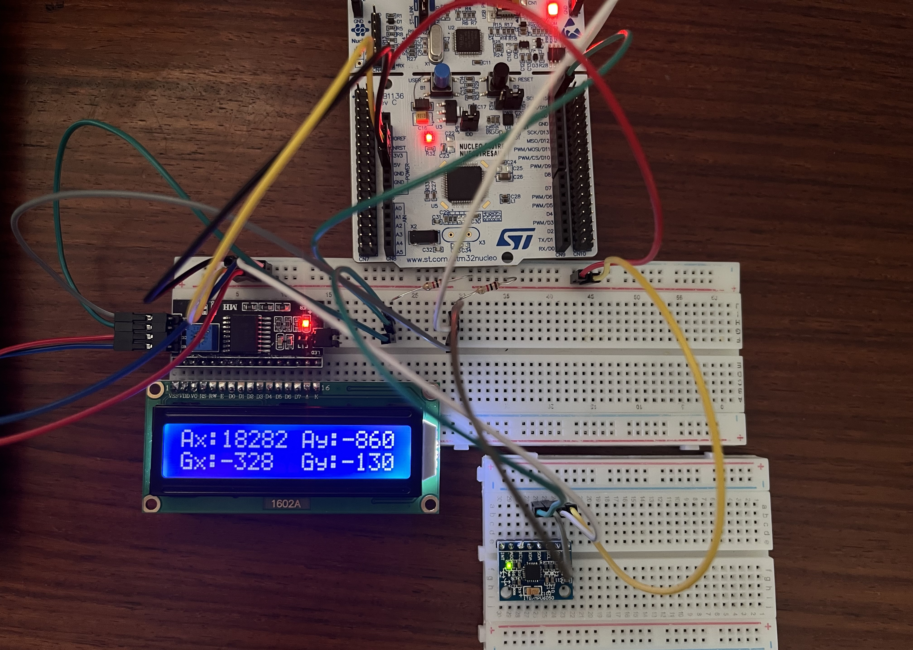

# Reading an IMU (raw data) through the LCD (two devices through I2C)

The inertial measurement unit (IMU) is to be connected through I2C. Considering that the LCD is also connected through this protocol, both need to share the SDA and SCL lines.

## 🧩 Sharing an I2C

## 📌 Finished prototype

