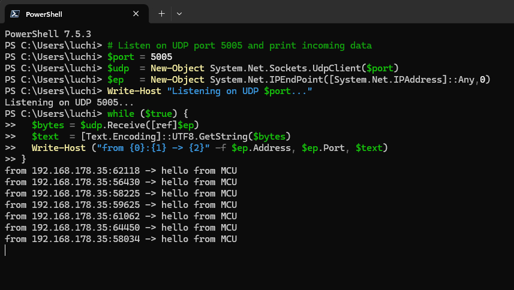

# DHCP UDP Button Ping (DISCO_F746NG)

Send a small UDP packet from an STM32F746NG board to a Windows PC every time the user button is pressed. The PC can be on Wi-Fi or Ethernet as long as both devices are on the same LAN. Optionally, the PC echoes the packet back so the MCU prints the reply.

## what it does

1. brings up Ethernet with DHCP (Dynamic Host Configuration Protocol) so the MCU gets a LAN IP  
2. opens a UDP socket (User Datagram Protocol)  
3. waits for button presses on BUTTON1  
4. on each press, sends a short message to the PC’s IP and selected UDP port  
5. optionally receives the echo reply and prints it

## hardware and software

- board: ST DISCO_F746NG (STM32F746NG MCU)  
- network: router that provides DHCP; MCU wired to a LAN port; PC on the same LAN (Wi-Fi or Ethernet)  
- mbed os: 6.x  
- toolchain: Mbed Studio
- pc: Windows 10/11 with PowerShell

## wiring

- MCU Ethernet jack to a router LAN port using a standard Ethernet cable  
- PC connected to the same router (Wi-Fi or Ethernet)

## pc listener

PowerShell echo server on UDP port 55055

If Windows Defender Firewall prompts you, allow PowerShell to listen on UDP. To open the port explicitly:

New-NetFirewallRule -DisplayName "UDP Echo 55055" -Direction Inbound -Action Allow -Protocol UDP -LocalPort 55055

# Sources of error

If the computer doesn't receive any message, try the following steps
- [Windows cmd / powershell] netstat -ano -p udp | findstr 5005
- [Windows cmd / powershell, for firewall allowance]  New-NetFirewallRule -DisplayName "UDP Listen 5005" -Direction Inbound -Action Allow -Protocol UDP -LocalPort 5003
- [Windows cmd / powershell, make sure of your PCs IP (IPv4, LAN)] ipconfig
- Make sure that your coded port in the MCU and Powershell match each other. Both should say 5005