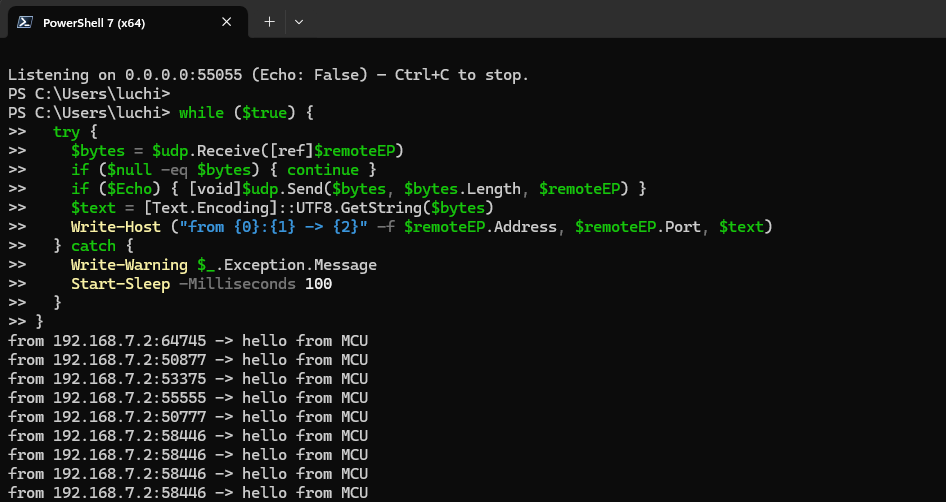

# UDP Button Sender (MCU → PC)

## Purpose  
Send a small UDP packet from an STM32F746NG board to a Windows PC every time the user button is pressed. The MCU and PC are connected directly with an Ethernet cable (no internet required).

## How it works  
- the MCU uses a static IP (default 192.168.7.2/24, gateway 0.0.0.0)  
- a UDP socket is opened once  
- on each button press, the MCU sends "hello from MCU" to the PC’s IP and port  
- the app runs forever

## PC setup (listener)  
Run a simple UDP listener on the PC using the PowerShell file provided "pcMain.ps1"

