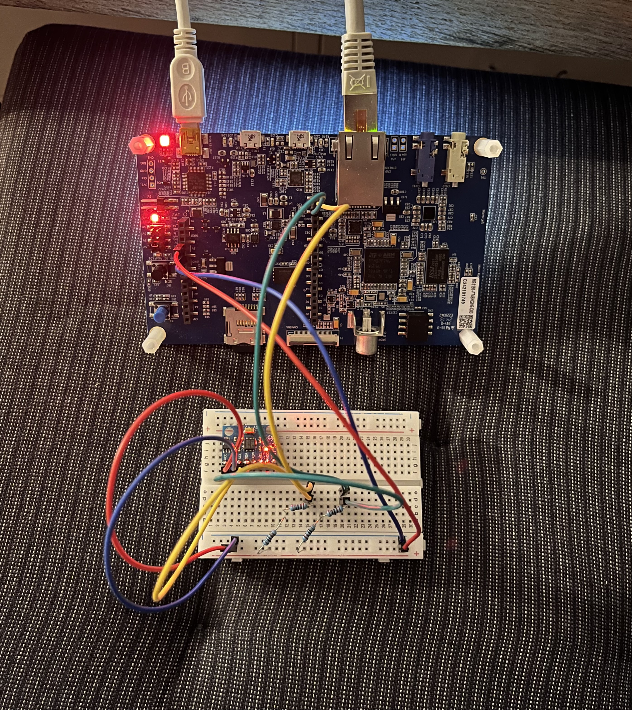
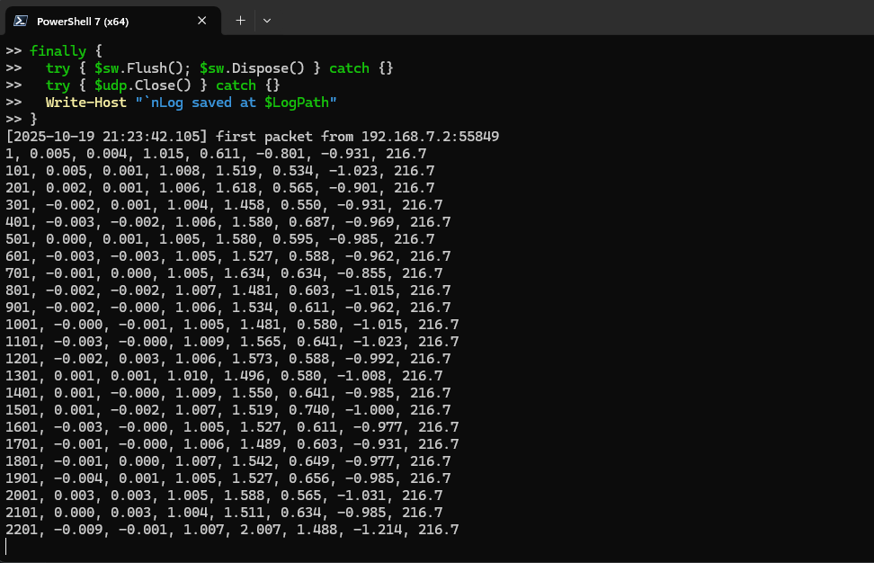
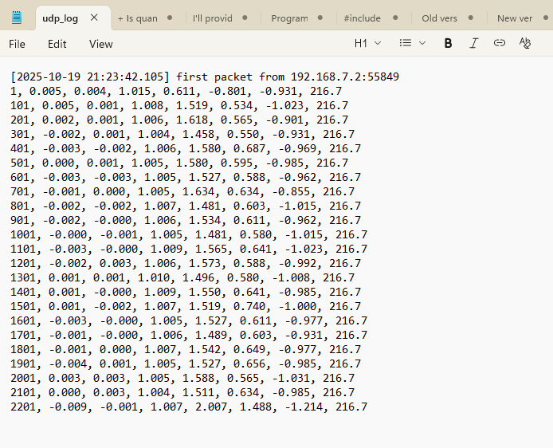

# MCU→PC Telemetry over Ethernet (STM32F746NG + PowerShell logger)

## Purpose  
Stream live IMU readings from an STM32F746NG board to a Windows PC through a direct Ethernet cable. The PC listens with a PowerShell script and appends each message to a .txt log. 
Developed for feeding a Java GUI that plots data in real time, for the University subject "Algorithms and Data Structures".

## How it works (high level)
- MCU configures a static IPv4 and opens a UDP socket.
- On each sample, the MCU formats a CSV payload and sends it to the PC’s IP/port.
- The PC runs a PowerShell listener that logs each line to a text file.

## Network setup (direct cable)
- PC wired adapter: 192.168.7.1 / 255.255.255.0
- MCU (in code): 192.168.7.2 / 255.255.255.0, gateway 0.0.0.0
- UDP destination: IP 192.168.7.1, port 55055

## Power and wiring for IMU (GY-521 / MPU-6050)
- Vcc → 3.3 V, GND → GND
- SDA → D14, SCL → D15
- pull-ups: one resistor from SDA to 3.3 V and one from SCL to 3.3 V

## Payload format (CSV)
timestamp_ms, accX_g, accY_g, accZ_g, gyroX_dps, gyroY_dps, gyroZ_dps, temp_C
example:
0, -0.002, -0.004, 1.000, 1.466, 0.176, -0.924, 216.7

## PC Listener
Open the command window, or a PowerShell window and paste "pcMain.ps1"

## MCU essentials (Mbed OS 6, C++)
Enable float printf using "mbed_app.json". The file should be stored in the same folder as main.cpp

## Credits
MCU code uses Mbed OS 6 and an MPU-6050 (GY-521) I²C driver
https://github.com/ET-BE/MBED-MPU6050