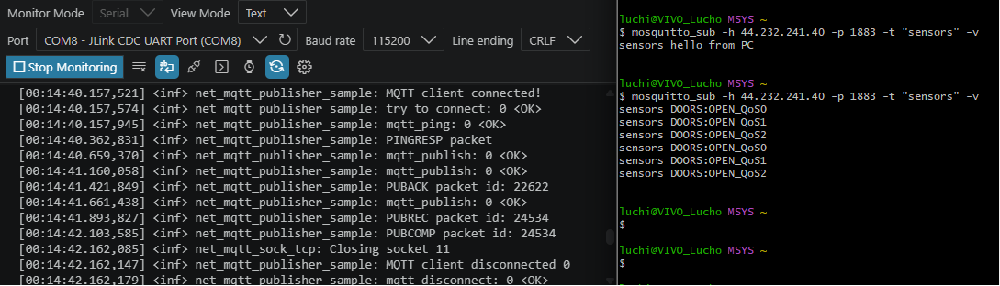

# FRDM-RW612 Zephyr MQTT over Wi-Fi Operation Guide

This README documents how to **build, flash, run, and test** the FRDM-RW612 Zephyr MQTT (Message Queuing Telemetry Transport) over Wi-Fi application after copying the Zephyr sample and project-specific files into the repository.

The application is now located at:

```text
C:\Users\luchi\source\repos\lcarricart\02-Microcontrollers\04-NXP\00-FRDM-RW612\04_zephyr_mqtt_wifi
```

The Zephyr workspace used to build it is currently:

```text
C:\Users\luchi\Github-Repository\not-repos\zephyrproject
```

---

## 1. Current Project Layout

The project should have this structure:

```text
04_zephyr_mqtt_wifi\
├── CMakeLists.txt
├── prj.conf
├── src\
│   ├── main.c
│   └── config.h
├── conf\
│   └── mqtt_wifi_emqx.conf
├── boards\
│   └── frdm_rw612_wifi.overlay
├── README.md
└── .gitignore
```

Important project-local files:

```text
conf\mqtt_wifi_emqx.conf
```

contains the project-specific Kconfig (Kernel Configuration) settings.

```text
boards\frdm_rw612_wifi.overlay
```

contains the project-specific Devicetree overlay.

Do not edit the original Zephyr sample under:

```text
zephyr\samples\net\mqtt_publisher
```

The repository now uses its own copied application.

---

## 2. Verified Runtime Context

Current tested parameters:

```text
Board target: frdm_rw612
Application path: C:\Users\luchi\source\repos\lcarricart\02-Microcontrollers\04-NXP\00-FRDM-RW612\04_zephyr_mqtt_wifi
MQTT broker IP used by the MCU: 44.232.241.40
MQTT broker port: 1883
Current MQTT topic: sensors
Wi-Fi SSID used during testing: Baum
```

The stock Zephyr MQTT publisher sample publishes to:

```text
sensors
```

not:

```text
python/mqtt
```

unless `src/main.c` is modified.

---

## 3. Open the Zephyr Workspace

Open a PowerShell terminal in VS Code and go to the Zephyr workspace:

```powershell
cd C:\Users\luchi\Github-Repository\not-repos\zephyrproject
.\.venv\Scripts\Activate.ps1
```

The prompt should show the active Python virtual environment:

```text
(.venv) PS C:\Users\luchi\Github-Repository\not-repos\zephyrproject>
```

Optional tool check:

```powershell
west --version
cmake --version
ninja --version
python --version
```

---

## 4. Build the Application

Use this command from the Zephyr workspace:

```powershell
west build -p always -b frdm_rw612 -S wifi-ipv4 "C:/Users/luchi/source/repos/lcarricart/02-Microcontrollers/04-NXP/00-FRDM-RW612/04_zephyr_mqtt_wifi" -- "-DEXTRA_CONF_FILE=C:/Users/luchi/source/repos/lcarricart/02-Microcontrollers/04-NXP/00-FRDM-RW612/04_zephyr_mqtt_wifi/conf/mqtt_wifi_emqx.conf" "-DDTC_OVERLAY_FILE=C:/Users/luchi/source/repos/lcarricart/02-Microcontrollers/04-NXP/00-FRDM-RW612/04_zephyr_mqtt_wifi/boards/frdm_rw612_wifi.overlay"
```

Meaning:

```text
-p always
    Force a pristine rebuild.

-b frdm_rw612
    Build for the NXP FRDM-RW612 board.

-S wifi-ipv4
    Add Zephyr's Wi-Fi IPv4 snippet.

Application path
    Build the copied repository application, not the upstream Zephyr sample.

-DEXTRA_CONF_FILE=...
    Use the repository-local MQTT/Wi-Fi configuration file.

-DDTC_OVERLAY_FILE=...
    Use the repository-local FRDM-RW612 Devicetree overlay.
```

Common path mistake:

```text
Wrong:
C: /Users/luchi/...

Correct:
C:/Users/luchi/...
```

There must be no space after `C:`.

---

## 5. Verify the Build Configuration

After building, verify that the expected Kconfig values were applied:

```powershell
Select-String -Path .\build\zephyr\.config -Pattern "NET_CONFIG_PEER_IPV4_ADDR|NET_SAMPLE_APP_MAX_ITERATIONS|NET_SAMPLE_APP_MAX_CONNECTIONS|ETH_DRIVER|WIFI_NXP|NXP_RW610"
```

Expected important lines:

```text
CONFIG_NET_CONFIG_PEER_IPV4_ADDR="44.232.241.40"
CONFIG_NET_SAMPLE_APP_MAX_ITERATIONS=1
CONFIG_NET_SAMPLE_APP_MAX_CONNECTIONS=0
# CONFIG_ETH_DRIVER is not set
CONFIG_WIFI_NXP=y
CONFIG_NXP_RW610=y
```

Important:

```text
CONFIG_NET_SAMPLE_APP_MAX_ITERATIONS=1
```

must not be accidentally changed to:

```text
CONFIG_NET_SAMPLE_APP_MAX_ITERATIONS=0
```

With `0`, the board can connect to MQTT and then skip the publish loop, which results in no messages being received by the PC listener.

---

## 6. Flash the Board

After a successful build:

```powershell
west flash
```

Open the serial monitor with:

```text
Baud rate:    115200
Data bits:    8
Parity:       none
Stop bits:    1
Flow control: none
```

This is usually written as:

```text
115200 8N1
```

---

## 7. Start the PC MQTT Listener in MSYS2

Open an MSYS2 terminal.

If `mosquitto_sub` is not found, add the UCRT64 binary directory to the current shell path:

```bash
export PATH="/ucrt64/bin:$PATH"
```

If you use MINGW64 instead of UCRT64, use:

```bash
export PATH="/mingw64/bin:$PATH"
```

Check that the Mosquitto tools are visible:

```bash
which mosquitto_sub
which mosquitto_pub
```

Start the listener:

```bash
mosquitto_sub -d -h 44.232.241.40 -p 1883 -t "sensors" -v
```

Expected startup output:

```text
Client null sending CONNECT
Client null received CONNACK (0)
Client null sending SUBSCRIBE
Client null received SUBACK
Subscribed (mid: 1): 0
```

After this, the terminal should stay open and wait for messages.

If the command immediately returns to the shell prompt, the listener is not actually running.

---

## 8. Verify the PC Listener Before Debugging the Board

In a second MSYS2 terminal, run:

```bash
export PATH="/ucrt64/bin:$PATH"
mosquitto_pub -d -h 44.232.241.40 -p 1883 -t "sensors" -m "hello from PC"
```

The listener terminal should print:

```text
sensors hello from PC
```

If this works, the PC, broker, topic, and Mosquitto tools are correct.

---

## 9. Connect the Board to Wi-Fi

In the board's Zephyr shell:

```text
wifi scan
```

Then connect:

```text
wifi connect -s "Baum" -k 1 -p "<your_wifi_password>"
```

Explanation:

```text
-s "Baum"
    SSID (Service Set Identifier), the Wi-Fi network name.

-k 1
    WPA2-PSK (Wi-Fi Protected Access 2 - Pre-Shared Key).

-p "<your_wifi_password>"
    Wi-Fi passphrase.
```

Expected board-side connection signs:

```text
Connection requested
Connected
net_dhcpv4: Received: 192.168.178.xx
net_config: IPv4 address: 192.168.178.xx
net_samples_common: Network connectivity established and IP address assigned
```

---

## 10. Expected MQTT Behavior

After Wi-Fi connects, the board should connect to MQTT and publish.

Expected board logs:

```text
net_mqtt_publisher_sample: attempting to connect:
net_mqtt: Connect completed
net_mqtt_publisher_sample: MQTT client connected!
net_mqtt_publisher_sample: try_to_connect: 0 <OK>
net_mqtt_publisher_sample: mqtt_ping: 0 <OK>
net_mqtt_publisher_sample: mqtt_publish: 0 <OK>
net_mqtt_publisher_sample: mqtt_publish: 0 <OK>
net_mqtt_publisher_sample: mqtt_publish: 0 <OK>
net_mqtt_publisher_sample: mqtt_disconnect: 0 <OK>
net_mqtt_publisher_sample: Bye!
```

Expected PC listener output:

```text
sensors DOORS:OPEN_QoS0
sensors DOORS:OPEN_QoS1
sensors DOORS:OPEN_QoS2
```

QoS means Quality of Service.

---

## 11. Current MQTT Topic

The current topic is defined in:

```text
src\main.c
```

The stock sample function is:

```c
static char *get_mqtt_topic(void)
{
#if APP_BLUEMIX_TOPIC
	return "iot-2/type/"BLUEMIX_DEVTYPE"/id/"BLUEMIX_DEVID
	       "/evt/"BLUEMIX_EVENT"/fmt/"BLUEMIX_FORMAT;
#else
	return "sensors";
#endif
}
```

Because `APP_BLUEMIX_TOPIC` is `0`, the active topic is:

```text
sensors
```

To later use:

```text
python/mqtt
```

change this line in the copied repository application:

```c
return "sensors";
```

to:

```c
return "python/mqtt";
```

Then rebuild and use this PC listener:

```bash
mosquitto_sub -d -h 44.232.241.40 -p 1883 -t "python/mqtt" -v
```

---

## 12. Troubleshooting Checklist

### 12.1 PC listener receives nothing

First verify PC publish/subscribe:

```bash
mosquitto_sub -d -h 44.232.241.40 -p 1883 -t "sensors" -v
```

In another terminal:

```bash
mosquitto_pub -d -h 44.232.241.40 -p 1883 -t "sensors" -m "hello from PC"
```

If the listener receives `sensors hello from PC`, the broker and PC tools are working.

---

### 12.2 Board connects to MQTT but sends no messages

If the board log shows:

```text
MQTT client connected!
try_to_connect: 0 <OK>
Closing socket
MQTT client disconnected 0
mqtt_disconnect: 0 <OK>
Bye!
```

but does not show:

```text
mqtt_publish: 0 <OK>
```

then the board connected but did not publish.

Check:

```powershell
Select-String -Path .\build\zephyr\.config -Pattern "NET_SAMPLE_APP_MAX_ITERATIONS"
```

Make sure it is:

```text
CONFIG_NET_SAMPLE_APP_MAX_ITERATIONS=1
```

not:

```text
CONFIG_NET_SAMPLE_APP_MAX_ITERATIONS=0
```

---

### 12.3 Board waits for Ethernet instead of Wi-Fi

If logs show:

```text
eth_nxp_enet_mac: Link is down
phy_mc_ksz8081: PHY autonegotiation timed out
```

check that the build config has Ethernet disabled:

```powershell
Select-String -Path .\build\zephyr\.config -Pattern "ETH_DRIVER"
```

Expected:

```text
# CONFIG_ETH_DRIVER is not set
```

Also make sure the build command uses:

```powershell
-S wifi-ipv4
```

and the repository-local config file:

```powershell
-DEXTRA_CONF_FILE=C:/Users/luchi/source/repos/lcarricart/02-Microcontrollers/04-NXP/00-FRDM-RW612/04_zephyr_mqtt_wifi/conf/mqtt_wifi_emqx.conf
```

---

## 13. Quick Operating Sequence

### 13.1 Build and flash from VS Code PowerShell

```powershell
cd C:\Users\luchi\Github-Repository\not-repos\zephyrproject
.\.venv\Scripts\Activate.ps1

west build -p always -b frdm_rw612 -S wifi-ipv4 "C:/Users/luchi/source/repos/lcarricart/02-Microcontrollers/04-NXP/00-FRDM-RW612/04_zephyr_mqtt_wifi" -- "-DEXTRA_CONF_FILE=C:/Users/luchi/source/repos/lcarricart/02-Microcontrollers/04-NXP/00-FRDM-RW612/04_zephyr_mqtt_wifi/conf/mqtt_wifi_emqx.conf" "-DDTC_OVERLAY_FILE=C:/Users/luchi/source/repos/lcarricart/02-Microcontrollers/04-NXP/00-FRDM-RW612/04_zephyr_mqtt_wifi/boards/frdm_rw612_wifi.overlay"

west flash
```

### 13.2 Start listener from MSYS2

```bash
export PATH="/ucrt64/bin:$PATH"
mosquitto_sub -d -h 44.232.241.40 -p 1883 -t "sensors" -v
```

### 13.3 Optional PC sanity publish from second MSYS2 terminal

```bash
export PATH="/ucrt64/bin:$PATH"
mosquitto_pub -d -h 44.232.241.40 -p 1883 -t "sensors" -m "hello from PC"
```

### 13.4 Connect board to Wi-Fi from serial shell

```text
wifi scan
wifi connect -s "Baum" -k 1 -p "<your_wifi_password>"
```

---

## 14. Git Notes

This repository should contain the copied application and project-local files only:

```text
CMakeLists.txt
prj.conf
src\
conf\
boards\
README.md
.gitignore
```

Do not commit the Zephyr workspace, `.venv`, `build`, downloaded modules, or generated firmware artifacts.

Recommended `.gitignore` entries:

```gitignore
# Zephyr build outputs
build/
build-*/
twister-out/

# CMake/Ninja generated files
CMakeCache.txt
CMakeFiles/
compile_commands.json
*.ninja
cmake_install.cmake

# Firmware artifacts
*.elf
*.hex
*.bin
*.map
*.lst
*.uf2

# Logs/cache
*.log
.cache/

# Local editor files
.vscode/
.idea/

# Never commit a local Zephyr workspace if accidentally copied
.venv/
.west/
zephyr/
modules/
bootloader/
tools/
```
