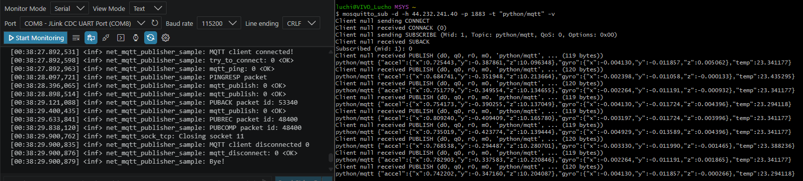
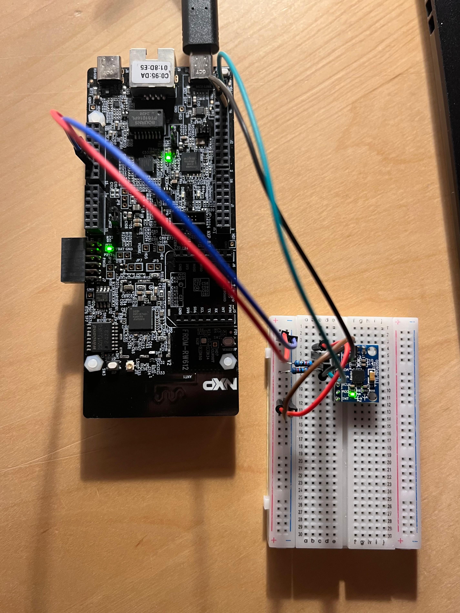

# FRDM-RW612 Zephyr MQTT + MPU6050 IMU Project Runbook

This document explains how to run the combined **FRDM-RW612 Zephyr MQTT (Message Queuing Telemetry Transport) + MPU6050 IMU (Inertial Measurement Unit)** project, how the application is structured, and what the flow inside `main.c` looks like.

The current working goal is:

```text
FRDM-RW612
	-> connects to Wi-Fi
	-> reads MPU6050 IMU data over I2C
	-> publishes data over MQTT
	-> PC receives the message with mosquitto_sub
```

---

## 0. Console Output and Physical Setup Pictures

Place the successful console output image first:

```markdown

```


Then place the physical setup image immediately after it:

```markdown

```


When this Markdown file is placed in the same folder as both images, they should render automatically.

Expected image file names:

```text
rw612_mqtt_imu_success.png
physical_setup.jpeg
```

Recommended physical setup image content:

```text
FRDM-RW612 board
MPU6050 module
SDA/SCL wiring
3.3V and GND wiring
USB cable to PC
```

---

## 1. Hardware Setup

### 1.1 Target Board

```text
Board: NXP FRDM-RW612
Zephyr board target: frdm_rw612
```

### 1.2 Sensor

```text
Sensor: MPU6050
Function: IMU (Inertial Measurement Unit)
Interface: I2C (Inter-Integrated Circuit)
Default I2C address: 0x68
Alternative I2C address: 0x69 if AD0 is pulled high
```

### 1.3 Wiring

The MPU6050 is connected to the Arduino I2C header path of the FRDM-RW612:

```text
FRDM-RW612 D18 / I2C SDA  -> MPU6050 SDA
FRDM-RW612 D19 / I2C SCL  -> MPU6050 SCL
FRDM-RW612 3.3V           -> MPU6050 VCC
FRDM-RW612 GND            -> MPU6050 GND
```

Relevant FRDM-RW612 schematic labels:

```text
GPIO_16_FC2_I2C_SDA_ARD
GPIO_17_FC2_I2C_SCL_ARD
```

This means the Arduino SDA/SCL pins are routed through the board’s Flexcomm 2 I2C peripheral.

Preferred Devicetree reference:

```dts
&arduino_i2c
```

Fallback Devicetree reference:

```dts
&flexcomm2
```

---

## 2. Project Location

Current combined project:

```text
C:\Users\luchi\source\repos\lcarricart\02-Microcontrollers\04-NXP\00-FRDM-RW612\06_zephyr_mqtt_imu
```

Zephyr workspace:

```text
C:\Users\luchi\Github-Repository\not-repos\zephyrproject
```

Python virtual environment:

```text
C:\Users\luchi\Github-Repository\not-repos\zephyrproject\.venv
```

Zephyr SDK (Software Development Kit):

```text
C:\Users\luchi\zephyr-sdk-1.0.1
```

---

## 3. Important Project Files

### 3.1 Application Source

```text
06_zephyr_mqtt_imu\src\main.c
```

This file contains the MQTT publisher logic and the MPU6050 payload integration.

### 3.2 Configuration File

```text
06_zephyr_mqtt_imu\conf\mqtt_imu_emqx.conf
```

This file contains the network, Wi-Fi, MQTT sample, stack, I2C, and sensor configuration.

### 3.3 Board Overlay

```text
06_zephyr_mqtt_imu\boards\frdm_rw612.overlay
```

This file enables the I2C bus and declares the MPU6050 node.

---

## 4. Required `mqtt_imu_emqx.conf` Settings

The config file should include these important options:

```conf
# MQTT broker
CONFIG_NET_CONFIG_PEER_IPV4_ADDR="44.232.241.40"

# MQTT sample loop
CONFIG_NET_SAMPLE_APP_MAX_ITERATIONS=1
CONFIG_NET_SAMPLE_APP_MAX_CONNECTIONS=0

# Wi-Fi / IPv4
CONFIG_NET_DHCPV4=y
CONFIG_NET_IPV6=n

CONFIG_WIFI=y
CONFIG_WIFI_NXP=y
CONFIG_NXP_RW610=y

CONFIG_NET_L2_WIFI_SHELL=y

# Disable Ethernet so the app does not wait for Ethernet PHY
CONFIG_ETH_DRIVER=n

# Stack and buffer tuning
CONFIG_MAIN_STACK_SIZE=5200
CONFIG_SHELL_STACK_SIZE=6144
CONFIG_NET_TX_STACK_SIZE=2048
CONFIG_NET_RX_STACK_SIZE=2048

CONFIG_NET_PKT_RX_COUNT=10
CONFIG_NET_PKT_TX_COUNT=10
CONFIG_NET_BUF_RX_COUNT=20
CONFIG_NET_BUF_TX_COUNT=20

CONFIG_NET_MAX_CONTEXTS=10
CONFIG_SYSTEM_WORKQUEUE_STACK_SIZE=2048
CONFIG_NET_MGMT_EVENT_STACK_SIZE=4608
CONFIG_NET_TCP_WORKQ_STACK_SIZE=2048
CONFIG_IDLE_STACK_SIZE=1024

# Network management
CONFIG_NET_MGMT_EVENT_QUEUE_TIMEOUT=5000
CONFIG_NET_MGMT_EVENT_QUEUE_SIZE=16

# Diagnostics
CONFIG_INIT_STACKS=y
CONFIG_NET_STATISTICS=y
CONFIG_NET_STATISTICS_PERIODIC_OUTPUT=n
CONFIG_WIFI_LOG_LEVEL_ERR=y

# MPU6050 IMU support
CONFIG_SENSOR=y
CONFIG_I2C=y
CONFIG_MPU6050_TRIGGER_NONE=y
CONFIG_CBPRINTF_FP_SUPPORT=y
```

Important note:

```conf
CONFIG_NET_SAMPLE_APP_MAX_ITERATIONS=1
```

must not be accidentally left as:

```conf
CONFIG_NET_SAMPLE_APP_MAX_ITERATIONS=0
```

If it is `0`, the MQTT connection may succeed, but the publish loop is skipped and no payload is sent.

---

## 5. Required `frdm_rw612.overlay`

Use this file:

```text
06_zephyr_mqtt_imu\boards\frdm_rw612.overlay
```

Recommended content:

```dts
&standby {
	status = "okay";
};

&arduino_i2c {
	status = "okay";
	clock-frequency = <100000>;

	mpu6050@68 {
		compatible = "invensense,mpu6050";
		reg = <0x68>;
		status = "okay";
	};
};
```

If `&arduino_i2c` causes a Devicetree error, replace only the I2C block with the fallback:

```dts
&standby {
	status = "okay";
};

&flexcomm2 {
	status = "okay";
	clock-frequency = <100000>;

	mpu6050@68 {
		compatible = "invensense,mpu6050";
		reg = <0x68>;
		status = "okay";
	};
};
```

Do not pass a manual `-DDTC_OVERLAY_FILE=...` if the automatic board overlay file is used.

Correct automatic overlay file name:

```text
boards\frdm_rw612.overlay
```

---

## 6. Build and Flash Procedure

Open PowerShell and go to the Zephyr workspace:

```powershell
cd "C:\Users\luchi\Github-Repository\not-repos\zephyrproject"
.\.venv\Scripts\Activate.ps1
```

Clean the previous build:

```powershell
Remove-Item -Recurse -Force ".\build" -ErrorAction SilentlyContinue
```

Build the project:

```powershell
west build -p always -b frdm_rw612 -S wifi-ipv4 "C:\Users\luchi\source\repos\lcarricart\02-Microcontrollers\04-NXP\00-FRDM-RW612\06_zephyr_mqtt_imu" -- "-DEXTRA_CONF_FILE=C:/Users/luchi/source/repos/lcarricart/02-Microcontrollers/04-NXP/00-FRDM-RW612/06_zephyr_mqtt_imu/conf/mqtt_imu_emqx.conf"
```

Flash the board:

```powershell
west flash -d .\build
```

---

## 7. Wi-Fi Connection on the Board

The board uses the Zephyr Wi-Fi shell.

Example command:

```text
wifi connect -s "Baum" -k 1 -p "<wifi_password>"
```

Meaning:

```text
-s
	SSID (Service Set Identifier)

-k 1
	WPA2-PSK (Wi-Fi Protected Access 2 - Pre-Shared Key)

-p
	Wi-Fi password/passphrase
```

Expected behavior:

```text
Wi-Fi connects
Board receives IPv4 address
Application can connect to MQTT broker
```

Example IPv4 address observed earlier:

```text
192.168.178.47
```

---

## 8. PC-Side MQTT Listener

The PC uses MSYS2 with Mosquitto tools.

If `mosquitto_sub` or `mosquitto_pub` is not found, run:

```bash
export PATH="/ucrt64/bin:$PATH"
```

Check that the tools are available:

```bash
which mosquitto_sub
which mosquitto_pub
```

Expected paths:

```text
/ucrt64/bin/mosquitto_sub
/ucrt64/bin/mosquitto_pub
```

### 8.1 Listen to All Topics During Debugging

```bash
mosquitto_sub -d -h 44.232.241.40 -p 1883 -t "#" -v
```

### 8.2 Listen Only to the Final Application Topic

```bash
mosquitto_sub -d -h 44.232.241.40 -p 1883 -t "python/mqtt" -v
```

### 8.3 PC-Side Sanity Publish

This verifies that the PC can reach the MQTT broker:

```bash
mosquitto_pub -d -h 44.232.241.40 -p 1883 -t "python/mqtt" -m "hello from PC"
```

---

## 9. MQTT Broker Settings

Broker hostname:

```text
broker.emqx.io
```

Resolved IPv4 address currently used by the firmware:

```text
44.232.241.40
```

MQTT port:

```text
1883
```

Transport:

```text
MQTT over TCP (Transmission Control Protocol), non-TLS
```

TLS means Transport Layer Security. This project currently uses normal unencrypted MQTT on port `1883`.

---

## 10. Expected Runtime Output

### 10.1 Serial Console

Expected relevant log lines:

```text
MPU6050 device is ready
attempting to connect:
MQTT client connected!
try_to_connect: 0 <OK>
mqtt_ping: 0 <OK>
mqtt_publish: 0 <OK>
mqtt_publish: 0 <OK>
mqtt_publish: 0 <OK>
mqtt_disconnect: 0 <OK>
Bye!
```

### 10.2 PC Listener

Expected MQTT message:

```text
python/mqtt {"accel":{"x":...,"y":...,"z":...},"gyro":{"x":...,"y":...,"z":...},"temp":...}
```

Example target JSON shape:

```json
{
  "accel": {
	"x": 0.123456,
	"y": -0.234567,
	"z": 9.810000
  },
  "gyro": {
	"x": 0.001234,
	"y": 0.000000,
	"z": -0.002345
  },
  "temp": 24.500000
}
```

---

## 11. Flow Inside `main.c`

The application keeps the original Zephyr MQTT publisher sample structure and changes the payload source.

The MQTT logic is intentionally preserved as much as possible.

---

### 11.1 High-Level Flow

```text
main()
	-> wait_for_network()
	-> optional TLS init if enabled
	-> start_app()

start_app()
	-> check whether MPU6050 device is ready
	-> repeatedly call publisher()

publisher()
	-> connect to MQTT broker
	-> ping broker
	-> publish QoS 0 payload
	-> process MQTT events
	-> publish QoS 1 payload
	-> process MQTT events
	-> publish QoS 2 payload
	-> process MQTT events
	-> disconnect
```

QoS means Quality of Service.

The app currently publishes three messages per cycle:

```text
QoS 0: at most once
QoS 1: at least once
QoS 2: exactly once
```

---

## 12. Detailed `main.c` Flow

### 12.1 `main()`

The entry point is:

```c
int main(void)
{
	wait_for_network();

#if defined(CONFIG_MQTT_LIB_TLS)
	int rc;

	rc = tls_init();
	PRINT_RESULT("tls_init", rc);
#endif

#if defined(CONFIG_USERSPACE)
	...
#else
	exit(start_app());
#endif
	return 0;
}
```

What it does:

```text
1. Waits for network readiness.
2. Initializes TLS only if TLS is enabled.
3. Starts the application through start_app().
```

Since this project uses normal MQTT over TCP on port `1883`, TLS is normally not enabled.

---

### 12.2 `start_app()`

Relevant logic:

```c
static int start_app(void)
{
	int r = 0;
	int i = 0;

	if (!device_is_ready(mpu6050_dev)) {
		LOG_ERR("MPU6050 device is not ready");
		imu_is_ready = false;
	} else {
		LOG_INF("MPU6050 device is ready");
		imu_is_ready = true;
	}

	while (!CONFIG_NET_SAMPLE_APP_MAX_CONNECTIONS ||
		   i++ < CONFIG_NET_SAMPLE_APP_MAX_CONNECTIONS) {
		r = publisher();

		if (!CONFIG_NET_SAMPLE_APP_MAX_CONNECTIONS) {
			k_sleep(K_MSEC(5000));
		}
	}

	return r;
}
```

What it does:

```text
1. Checks whether the MPU6050 Zephyr device is ready.
2. Stores the result in imu_is_ready.
3. Calls publisher() repeatedly.
4. If max connections is 0, the app reconnects forever with 5-second pauses.
```

Important:

```text
device_is_ready(mpu6050_dev)
```

does not necessarily mean the sensor measurement is successful. It means the Zephyr device object was initialized and is ready to be used.

The actual I2C communication is checked later during:

```c
sensor_sample_fetch(mpu6050_dev);
```

---

### 12.3 `publisher()`

Relevant logic:

```c
static int publisher(void)
{
	int i, rc, r = 0;

	include_topic = true;
	aliases_enabled = false;

	LOG_INF("attempting to connect: ");
	rc = try_to_connect(&client_ctx);
	PRINT_RESULT("try_to_connect", rc);
	SUCCESS_OR_EXIT(rc);

	i = 0;
	while (i++ < CONFIG_NET_SAMPLE_APP_MAX_ITERATIONS && connected) {
		r = -1;

		rc = mqtt_ping(&client_ctx);
		PRINT_RESULT("mqtt_ping", rc);
		SUCCESS_OR_BREAK(rc);

		rc = process_mqtt_and_sleep(&client_ctx, APP_SLEEP_MSECS);
		SUCCESS_OR_BREAK(rc);

		rc = publish(&client_ctx, MQTT_QOS_0_AT_MOST_ONCE);
		PRINT_RESULT("mqtt_publish", rc);
		SUCCESS_OR_BREAK(rc);

		rc = process_mqtt_and_sleep(&client_ctx, APP_SLEEP_MSECS);
		SUCCESS_OR_BREAK(rc);

		rc = publish(&client_ctx, MQTT_QOS_1_AT_LEAST_ONCE);
		PRINT_RESULT("mqtt_publish", rc);
		SUCCESS_OR_BREAK(rc);

		rc = process_mqtt_and_sleep(&client_ctx, APP_SLEEP_MSECS);
		SUCCESS_OR_BREAK(rc);

		rc = publish(&client_ctx, MQTT_QOS_2_EXACTLY_ONCE);
		PRINT_RESULT("mqtt_publish", rc);
		SUCCESS_OR_BREAK(rc);

		rc = process_mqtt_and_sleep(&client_ctx, APP_SLEEP_MSECS);
		SUCCESS_OR_BREAK(rc);

		r = 0;
	}

	rc = mqtt_disconnect(&client_ctx, NULL);
	PRINT_RESULT("mqtt_disconnect", rc);

	LOG_INF("Bye!");

	return r;
}
```

What it does:

```text
1. Initializes topic behavior.
2. Connects to the MQTT broker.
3. Sends an MQTT ping.
4. Publishes QoS 0 message.
5. Processes MQTT events.
6. Publishes QoS 1 message.
7. Processes MQTT events.
8. Publishes QoS 2 message.
9. Processes MQTT events.
10. Disconnects from the broker.
```

Critical config dependency:

```conf
CONFIG_NET_SAMPLE_APP_MAX_ITERATIONS=1
```

If this value is `0`, the `while` loop is skipped and nothing is published.

---

### 12.4 `publish()`

Relevant logic:

```c
static int publish(struct mqtt_client *client, enum mqtt_qos qos)
{
	struct mqtt_publish_param param = { 0 };

	if (include_topic) {
		param.message.topic.topic.utf8 = (uint8_t *)get_mqtt_topic();
		param.message.topic.topic.size =
			strlen(param.message.topic.topic.utf8);
	}

	param.message.topic.qos = qos;
	param.message.payload.data = get_mqtt_payload(qos);
	param.message.payload.len =
			strlen(param.message.payload.data);
	param.message_id = sys_rand16_get();
	param.dup_flag = 0U;
	param.retain_flag = 0U;

#if defined(CONFIG_MQTT_VERSION_5_0)
	if (aliases_enabled) {
		param.prop.topic_alias = APP_TOPIC_ALIAS;
		include_topic = false;
	}
#endif

	return mqtt_publish(client, &param);
}
```

What it does:

```text
1. Creates an MQTT publish parameter struct.
2. Gets the MQTT topic from get_mqtt_topic().
3. Gets the payload from get_mqtt_payload().
4. Calculates payload length.
5. Assigns a random message ID.
6. Calls mqtt_publish().
```

Important behavior:

```text
get_mqtt_payload() is called before mqtt_publish().
```

Therefore, if payload generation blocks or fails badly, MQTT publishing may not happen.

This was the key debugging point when no messages were being sent.

---

### 12.5 `get_mqtt_topic()`

Current topic function:

```c
static char *get_mqtt_topic(void)
{
	static APP_DMEM char topic[] = APP_MQTT_TOPIC;

	return topic;
}
```

Topic definition:

```c
#define APP_MQTT_TOPIC "python/mqtt"
```

Final topic:

```text
python/mqtt
```

---

### 12.6 `get_mqtt_payload()`

Current payload function:

```c
static char *get_mqtt_payload(enum mqtt_qos qos)
{
	static APP_DMEM char payload[APP_IMU_PAYLOAD_SIZE];
	int ret;

	ARG_UNUSED(qos);

	ret = app_read_imu_payload(payload, sizeof(payload));
	if (ret < 0) {
		LOG_ERR("Failed to read IMU payload: %d", ret);
	}

	return payload;
}
```

What it does:

```text
1. Creates a static payload buffer.
2. Calls app_read_imu_payload().
3. Returns the payload buffer to publish().
```

The payload buffer is static because the MQTT publish parameter stores a pointer to the payload.

---

### 12.7 `app_read_imu_payload()`

This function is the bridge between the MPU6050 driver and MQTT.

High-level flow:

```text
app_read_imu_payload()
	-> if IMU is not ready, create {"imu":"not_ready"}
	-> sensor_sample_fetch()
	-> sensor_channel_get() accelerometer XYZ
	-> sensor_channel_get() gyroscope XYZ
	-> sensor_channel_get() die temperature
	-> format sensor values
	-> write final JSON payload
```

Important sensor calls:

```c
sensor_sample_fetch(mpu6050_dev);
sensor_channel_get(mpu6050_dev, SENSOR_CHAN_ACCEL_XYZ, accel);
sensor_channel_get(mpu6050_dev, SENSOR_CHAN_GYRO_XYZ, gyro);
sensor_channel_get(mpu6050_dev, SENSOR_CHAN_DIE_TEMP, &temperature_value);
```

Possible error payloads:

```json
{"imu":"not_ready"}
```

```json
{"imu":"fetch_error","err":-5}
```

```json
{"imu":"accel_error","err":-5}
```

```json
{"imu":"gyro_error","err":-5}
```

```json
{"imu":"temp_error","err":-5}
```

These are useful because they prove that MQTT is alive while showing which IMU stage failed.

---

### 12.8 `app_format_sensor_value()`

The MPU6050 sensor values use Zephyr’s:

```c
struct sensor_value
```

This structure has:

```text
val1: integer part
val2: fractional part in one-millionths
```

Example:

```text
val1 = 9
val2 = 810000
```

becomes:

```text
9.810000
```

Important detail:

A value like:

```text
-0.234567
```

can be represented as:

```text
val1 = 0
val2 = -234567
```

Therefore, the formatter must preserve the negative sign even when `val1` is zero.

---

## 13. Debugging Flow

### 13.1 Build Uses the Wrong App

Symptom:

```text
You still see DOORS:OPEN_QoSx
```

Cause:

```text
The old MQTT publisher sample is still being built or flashed.
```

Check:

```powershell
Select-String -Path "C:\Users\luchi\source\repos\lcarricart\02-Microcontrollers\04-NXP\00-FRDM-RW612\06_zephyr_mqtt_imu\src\main.c" -Pattern "DOORS|OPEN_QoS|sensors|python/mqtt"
```

Expected:

```text
Only python/mqtt should appear.
```

Also check the build output:

```text
-- Application: C:/Users/luchi/source/repos/lcarricart/02-Microcontrollers/04-NXP/00-FRDM-RW612/06_zephyr_mqtt_imu
```

It must not point to:

```text
04_zephyr_mqtt_wifi
```

or:

```text
zephyr/samples/net/mqtt_publisher
```

---

### 13.2 MQTT Connects but Nothing Is Sent

Most likely cause:

```conf
CONFIG_NET_SAMPLE_APP_MAX_ITERATIONS=0
```

Fix:

```conf
CONFIG_NET_SAMPLE_APP_MAX_ITERATIONS=1
```

Check generated config:

```powershell
Select-String -Path .\build\zephyr\.config -Pattern "NET_SAMPLE_APP_MAX_ITERATIONS|NET_SAMPLE_APP_MAX_CONNECTIONS"
```

Expected:

```text
CONFIG_NET_SAMPLE_APP_MAX_ITERATIONS=1
CONFIG_NET_SAMPLE_APP_MAX_CONNECTIONS=0
```

---

### 13.3 MQTT Publishes but PC Receives Nothing

Check the PC subscriber topic.

Use all topics first:

```bash
mosquitto_sub -d -h 44.232.241.40 -p 1883 -t "#" -v
```

Then use final topic:

```bash
mosquitto_sub -d -h 44.232.241.40 -p 1883 -t "python/mqtt" -v
```

Also check that the firmware uses:

```c
#define APP_MQTT_TOPIC "python/mqtt"
```

---

### 13.4 IMU Device Is Not Ready

Serial output:

```text
MPU6050 device is not ready
```

Possible causes:

```text
1. Devicetree overlay not picked up.
2. Wrong overlay file name.
3. Wrong I2C bus reference.
4. MPU6050 driver not enabled through Devicetree.
```

Check Devicetree:

```powershell
Select-String -Path .\build\zephyr\zephyr.dts -Pattern "mpu6050|invensense|arduino_i2c|flexcomm2"
```

Expected node:

```dts
mpu6050@68 {
	compatible = "invensense,mpu6050";
	reg = <0x68>;
	status = "okay";
};
```

---

### 13.5 IMU Fetch Error

Payload:

```json
{"imu":"fetch_error","err":-5}
```

Possible causes:

```text
1. Wrong I2C address: try 0x69 instead of 0x68.
2. SDA and SCL swapped.
3. Missing pull-ups on SDA/SCL.
4. Weak jumper connection.
5. MPU6050 not powered correctly.
6. Wrong I2C bus selected in overlay.
```

For the address change, modify:

```dts
reg = <0x68>;
```

to:

```dts
reg = <0x69>;
```

then rebuild and flash.

---

## 14. Useful Verification Commands

### 14.1 Check Generated Kconfig

```powershell
Select-String -Path .\build\zephyr\.config -Pattern "NET_CONFIG_PEER_IPV4_ADDR|NET_SAMPLE_APP_MAX_ITERATIONS|ETH_DRIVER|WIFI_NXP|NXP_RW610|SENSOR|I2C|MPU6050|CBPRINTF_FP_SUPPORT"
```

Expected important lines:

```text
CONFIG_NET_CONFIG_PEER_IPV4_ADDR="44.232.241.40"
CONFIG_NET_SAMPLE_APP_MAX_ITERATIONS=1
# CONFIG_ETH_DRIVER is not set
CONFIG_WIFI_NXP=y
CONFIG_NXP_RW610=y
CONFIG_SENSOR=y
CONFIG_I2C=y
CONFIG_MPU6050_TRIGGER_NONE=y
CONFIG_CBPRINTF_FP_SUPPORT=y
```

### 14.2 Check Generated Devicetree

```powershell
Select-String -Path .\build\zephyr\zephyr.dts -Pattern "mpu6050|invensense|arduino_i2c|flexcomm2"
```

### 14.3 Search for Old MQTT Payload

```powershell
Select-String -Path "C:\Users\luchi\source\repos\lcarricart\02-Microcontrollers\04-NXP\00-FRDM-RW612\06_zephyr_mqtt_imu\*" -Recurse -Pattern "DOORS|OPEN_QoS|sensors|python/mqtt"
```

Expected:

```text
No DOORS payload should exist in the active app source.
```

---

## 15. Clean Rebuild Checklist

Use this whenever behavior looks stale or inconsistent:

```powershell
cd "C:\Users\luchi\Github-Repository\not-repos\zephyrproject"
.\.venv\Scripts\Activate.ps1

Remove-Item -Recurse -Force ".\build" -ErrorAction SilentlyContinue

west build -p always -b frdm_rw612 -S wifi-ipv4 "C:\Users\luchi\source\repos\lcarricart\02-Microcontrollers\04-NXP\00-FRDM-RW612\06_zephyr_mqtt_imu" -- "-DEXTRA_CONF_FILE=C:/Users/luchi/source/repos/lcarricart/02-Microcontrollers/04-NXP/00-FRDM-RW612/06_zephyr_mqtt_imu/conf/mqtt_imu_emqx.conf"

west flash -d .\build
```

---

## 16. Current Working Concept

The application is no longer a static MQTT publisher.

Original behavior:

```text
MQTT publishes: DOORS:OPEN_QoSx
Topic: sensors
```

Current behavior:

```text
MQTT publishes: MPU6050 JSON payload
Topic: python/mqtt
```

The critical project integration is:

```text
MQTT sample structure remains mostly unchanged.
Only the topic and payload generation path were changed.
The payload now comes from the MPU6050 sensor API.
```

---

## 17. Minimal Mental Model

Think of the app as three layers:

```text
Layer 1: Network and Wi-Fi
	Responsible for getting the board online.

Layer 2: MQTT publisher
	Responsible for connecting, pinging, publishing, and disconnecting.

Layer 3: IMU payload provider
	Responsible for reading MPU6050 values and formatting them as JSON.
```

The key function boundary is:

```c
param.message.payload.data = get_mqtt_payload(qos);
```

That line is where the MQTT layer asks the IMU layer:

```text
"Give me the message body I should publish."
```

Then MQTT sends it through:

```c
mqtt_publish(client, &param);
```

---

## 18. Handoff Summary

To continue this project later, remember:

```text
Project: 06_zephyr_mqtt_imu
Board: frdm_rw612
Sensor: MPU6050 over I2C
Broker: broker.emqx.io / 44.232.241.40
Port: 1883
Topic: python/mqtt
Payload: JSON with accel, gyro, temp
Main issue solved: old static payload replaced by IMU-generated payload
Important config: CONFIG_NET_SAMPLE_APP_MAX_ITERATIONS=1
```

Recommended next improvement:

```text
Reduce the app to only one QoS level, probably QoS 0 or QoS 1, once debugging is complete.
```

For a real sensor telemetry application, publishing one message periodically with QoS 0 or QoS 1 is simpler than publishing the same payload three times with QoS 0, QoS 1, and QoS 2.
