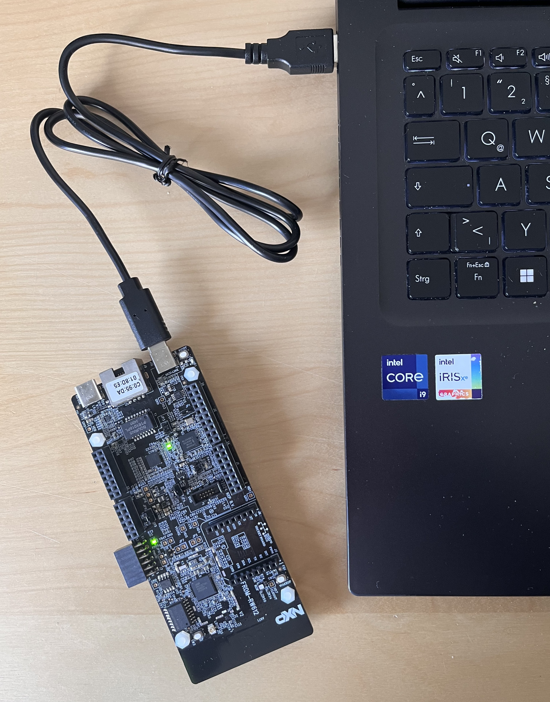

# Basic Prototype: MCU to remote Mosquitto MQTT broker via WiFi
In order to inspect the entry point main.c, navigate through the following folders
```text
/02_RW612_WiFi_MQTT > source > wifi_mqtt.c
```
The application is implemented using an RTOS-based structure. Due to the amount of dependencies, it is recommended to open the project using Eclipse and navigate through functions using "Ctrl+Click".

---

## Requirements
- NXP FRDM-RW612 microcontroller
- Internet via WiFi
- 5V power suppply (computer)



---

## Technical Description
The application is an out-of-the-box example provided by NXP in its SDK support for this board. It uses its integrated tri-radio module to communicate with a ready-available Mosquitto MQTT broker.
 1. Initialize the device and its WiFi module
 2. Establish connection with a known WiFi network (SSID and key must be configured)
 3. Using Internet, connect to a remote test Mosquitto broker "test.mosquitto.org" (already existing)
 4. Subscribe to a topic "lwip_topic/#" in order to later receive any message sent to it
 5. Subscribe to another topic "lwip_other/#" (# means receive messages from all its subtopics too)
 6. Publish a message "message from board" to the topic "lwip_topic/100"
 7. Receive Y amount of bytes from the topic X. Message received Z
 8. Publish and receives more messages
 9. Disconnect from MQTT broker

---

## User Configuration
WiFi configuration can be changed by modifying the following parameters
- AP_SSID
- AP_PASSWORD

Broker configuration can be changed by moodifying the followinng parameters
- EXAMPLE_MQTT_SERVER_HOST
- EXAMPLE_MQTT_SERVER_PORT

---

## MCU Output
Output printed in real-time for debugging purposes once the application runs.

```text
/************************************************
 MQTT client example
/************************************************
[ i ] Initializing Wi-Fi connection... 
STA MAC Address: C0:95:DA:01:71:51 
board_type: 2, board_type mapping: 
0----QFN
1----CSP
2----BGA

[ i ] Successfully initialized Wi-Fi module
Connecting as client to ssid: Baum with password XXXXXXXXXXXXXXXX
board_type: 2, board_type mapping: 
0----QFN
1----CSP
2----BGA

[ i ] Connected to Wi-Fi
ssid: Baum
[ ! ]passphrase: XXXXXXXXXXXXXXXX

IPv4 Address     : 192.168.178.47
IPv4 Subnet mask : 255.255.255.0
IPv4 Gateway     : 192.168.178.1

Resolving "test.mosquitto.org"...
Connecting to MQTT broker at 54.36.178.49...
MQTT client "nxp_32a4a52081a94c89e848c9e4f57f5735" connected.

Subscribing to the topic "lwip_topic/#" with QoS 0...
Subscribing to the topic "lwip_other/#" with QoS 1...

Going to publish to the topic "lwip_topic/100"...

Subscribed to the topic "lwip_topic/#".
Subscribed to the topic "lwip_other/#".

Received 18 bytes from the topic "lwip_topic/100": "message from board"

Published to the topic "lwip_topic/100".
Going to publish to the topic "lwip_topic/100"...
Received 18 bytes from the topic "lwip_topic/100": "message from board"

Published to the topic "lwip_topic/100".
Going to publish to the topic "lwip_topic/100"...
Received 18 bytes from the topic "lwip_topic/100": "message from board"

Published to the topic "lwip_topic/100".
Going to publish to the topic "lwip_topic/100"...
Received 18 bytes from the topic "lwip_topic/100": "message from board"

Published to the topic "lwip_topic/100".
Going to publish to the topic "lwip_topic/100"...
Received 18 bytes from the topic "lwip_topic/100": "message from board"

Published to the topic "lwip_topic/100".

Disconnected from MQTT broker.
```


