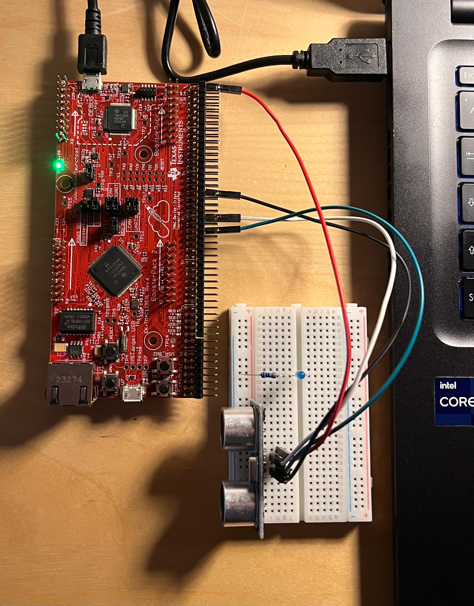

# Ultrasonic Sensor Driver — TM4C1294NCPDT

Brief bare-metal ultrasonic sensor project for the **TM4C1294NCPDT**. The project manually configures GPIO and GPT timers to send a trigger pulse, capture the echo pulse width, and calculate the object distance in centimeters.

## Hardware Setup


## Serial Monitor Output



## Pinout

| Signal | MCU Pin |
|---|---|
| Trigger | PD6 |
| Echo | PD1 / T0CCP1 |

## Project Flow

1. Configure **TIM1A** as a delay timer for `sleep_us()` and `sleep_ms()`.
2. Configure **TIM0B** in capture edge-time mode to detect rising and falling edges on the echo signal.
3. Send a trigger pulse longer than 10 µs on `PD6`.
4. Capture the echo pulse width using `TIM0B`.
5. Convert the raw timer ticks into distance using the speed of sound.
6. Print the calculated distance over the serial monitor.

## Timing and Distance Calculation

The timer uses a 16 MHz reference clock:

```text
1 µs = 16 timer ticks
```

The echo pulse represents the round-trip travel time of the ultrasonic wave, so the measured time is divided by 2.

```text
time_us = timer_count / 16
half_time_us = time_us / 2
distance_cm = (34300 cm/s × half_time_us) / 1,000,000
```

## Main Components

| Function | Purpose |
|---|---|
| `configure_tim0()` | Configures TIM1A for delay and TIM0B for capture mode |
| `configure_trigger_echo_pins()` | Configures trigger and echo pins |
| `trigger_ultrasonic()` | Sends the ultrasonic trigger pulse |
| `echo_read_time()` | Captures the echo pulse width in timer ticks |
| `calculate_distance_cm()` | Converts captured timer ticks to distance in centimeters |

## Notes

- `TIM1A` is used for blocking delay functions.
- `TIM0B` is used for edge capture on the echo signal.
- The trigger signal is generated manually through GPIO.
- The calculation assumes a speed of sound of approximately **343 m/s**.
